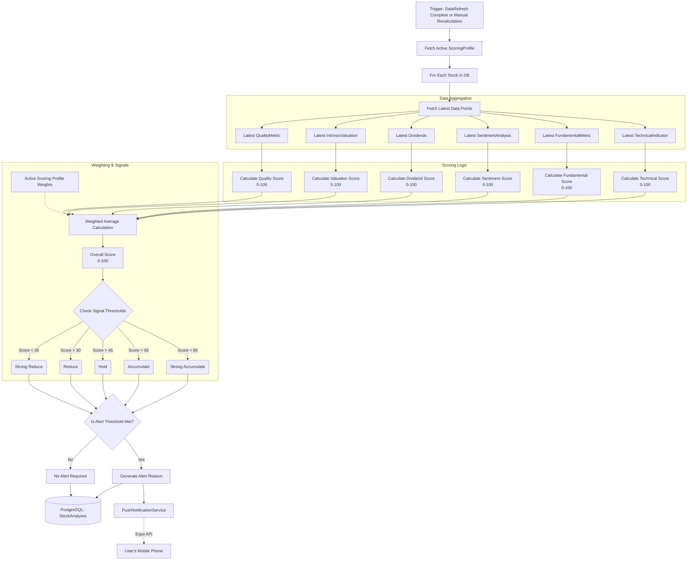

# Analysis Engine Flow

The Analysis Engine (`StockAnalysisEngine`) is the final step in the data pipeline. Once all raw historical data, fundamentals, technical indicators, and sentiment have been fetched and calculated, the engine applies user-defined weightings (from a `ScoringProfile`) to generate actionable Buy/Sell/Hold signals.

## Engine Workflow

## Scoring Profiles
The system allows users to define custom `ScoringProfiles`. A profile dictates the percentage weight assigned to each category. 

For example, a **"Value Investor"** profile might be configured as:
- Fundamental Weight: 60%
- Dividend Weight: 20%
- Technical Weight: 10%
- Sentiment Weight: 10%

Additionally, there are **sub-weights** within the Technical and Fundamental categories. For instance, the Technical category has internal weights for RSI, MACD, Moving Averages, Bollinger Bands, ADX, and Volume. 

**Recent Enhancements:**
- **Sentiment Scoring:** Uses a sigmoid (tanh) curve for smooth variance and applies a confidence penalty if there are too few news articles, avoiding extreme scores from single articles. Evaluates bigrams and 3-word negation windows specific to the Indian market.
- **Technical Scoring:** Uses **Adjusted Close** prices (falling back to Close) so that stock splits and bonuses do not skew the indicators. We calculate 18 full indicators: RSI, MACD, SMA (20/50/200), EMA (12/26), Bollinger Bands, ATR, ADX, Stochastic, OBV, MFI, CCI, Williams %R, Parabolic SAR, and Ichimoku.
  - **MACD:** Scored dynamically based on histogram magnitude relative to current price.
  - **ADX:** Evaluated directionally using +DI vs -DI crossovers rather than absolute trend strength.
  - **OBV:** Evaluated directionally against a 20-period Simple Moving Average of the OBV line.
- **Valuation Scoring:** Calculates Intrinsic Value upside percentage based on Fair Value (DCF-lite) and Graham Number. Kept separate from Fundamentals to prevent double-counting.
- **Quality Scoring:** Evaluates Piotroski F-Score (0–9), Altman Z-Score for bankruptcy risk, Promoter/FII holding trends, Dividend consistency, and Free Cash Flow trend.

When the engine runs, it first calculates each of the 6 category's scores using its internal sub-weights. Then, it multiplies the raw 0-100 score of each category by the top-level percentages to determine the stock's final `OverallScore`.
