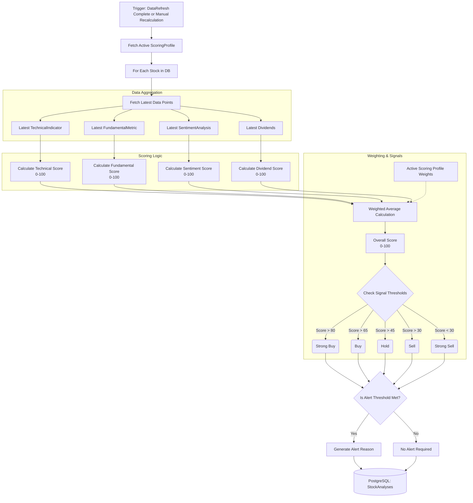

# Analysis Engine Flow

The Analysis Engine (`StockAnalysisEngine`) is the final step in the data pipeline. Once all raw historical data, fundamentals, technical indicators, and sentiment have been fetched and calculated, the engine applies user-defined weightings (from a `ScoringProfile`) to generate actionable Buy/Sell/Hold signals.

## Engine Workflow

## Scoring Profiles
The system allows users to define custom `ScoringProfiles`. A profile dictates the percentage weight assigned to each category. 

For example, a **"Value Investor"** profile might be configured as:
- Fundamental Weight: 60%
- Dividend Weight: 20%
- Technical Weight: 10%
- Sentiment Weight: 10%

Additionally, there are **sub-weights** within the Technical and Fundamental categories. For instance, the Technical category has internal weights for RSI, MACD, Moving Averages, Bollinger Bands, ADX, and Volume. 

When the engine runs, it first calculates each category's score using its internal sub-weights. Then, it multiplies the raw 0-100 score of each category by the top-level percentages to determine the stock's final `OverallScore`.
