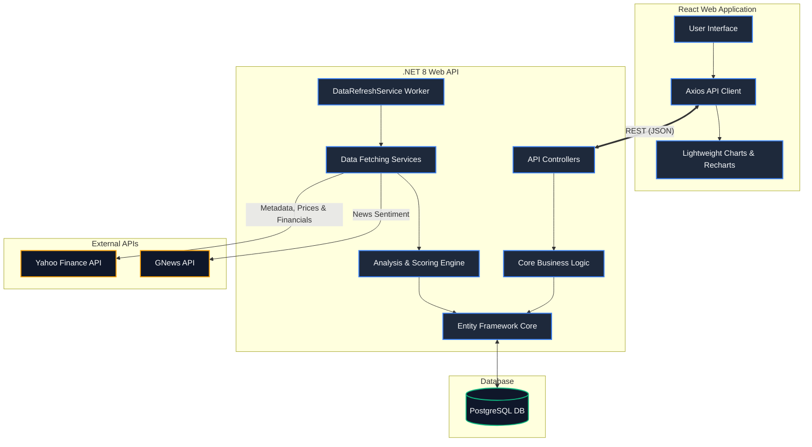

# System Architecture

The Nifty50 Stock Analyzer is built using a modern decoupled architecture. The backend is a .NET 8 Web API that uses Entity Framework Core to interface with a PostgreSQL database. The frontend is a React application built with Vite and Tailwind CSS.

## High-Level Overview

## Component Details

1. **Frontend**: Built with React, it features a responsive dashboard. It polls the backend API to retrieve stock prices, historical metrics, and sentiment analysis.
2. **Backend Controllers**: Exposes a clean RESTful API (`/api/stocks`, `/api/dashboard`, `/api/scoring-profiles`) consumed by the frontend.
3. **Background Worker**: The `DataRefreshService` is an `IHostedService` that runs continuously in the background (on a configurable interval, e.g. every 24 hours), ensuring the database is always up to date with the latest market data without blocking the main API threads.
4. **Data Services**: Handlers like `YahooFinanceService`, `YahooMetadataService`, and `GNewsSentimentService` manage HTTP requests, API rate limits, and custom Cookie/Crumb extraction to interface with third-party providers. The metadata service ensures critical fields like Market Cap, Sector, and Shares Outstanding are always populated.
