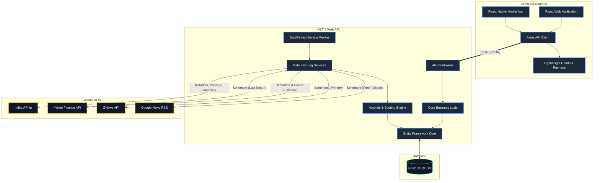

# System Architecture

The Nifty50 Stock Analyzer is built using a modern decoupled architecture. The backend is a .NET 10 Web API that uses Entity Framework Core to interface with a PostgreSQL database. The frontend is a React application built with Vite and Tailwind CSS.

## High-Level Overview

## Component Details

1. **Frontend Applications**: Built with React (Web) and React Native (Mobile), providing responsive dashboards. They poll the backend API to retrieve stock prices, historical metrics, and sentiment analysis.
2. **Backend Controllers**: Exposes a clean RESTful API (`/api/stocks`, `/api/dashboard`, `/api/scoring-profiles`) consumed by the frontends.
3. **Background Worker**: The `DataRefreshService` is an `IHostedService` that runs continuously in the background (on a configurable interval, e.g. every 24 hours), ensuring the database is always up to date with the latest market data without blocking the main API threads.
4. **Data Services**: Handlers like `IndianApiService` and `GNewsSentimentService` manage HTTP requests, API rate limits, and JSON parsing. The primary `IndianApiService` fetches metadata, real-time prices, deep fundamentals, and institutional shareholding patterns. Sentiment analysis uses a robust 3-tier fallback strategy (`GNews` → `GoogleNewsRSS` → `YahooFinance`) to guarantee relevant headlines even without an API key.
5. **Analysis Engine**: The `StockAnalysisEngine` calculates a final 0-100 score based on 6 independent dimensions (Technical, Fundamental, Valuation, Quality, Sentiment, Dividend). It applies configurable `ScoringProfile` weights to generate SEBI-compliant signals (Accumulate/Hold/Reduce).
6. **Admin & Monitoring**: An in-memory `ApiMonitorService` tracks all external requests, providing real-time success rates, latencies, and error logs directly in the React Admin panel, where users can also manually trigger data refreshes.
