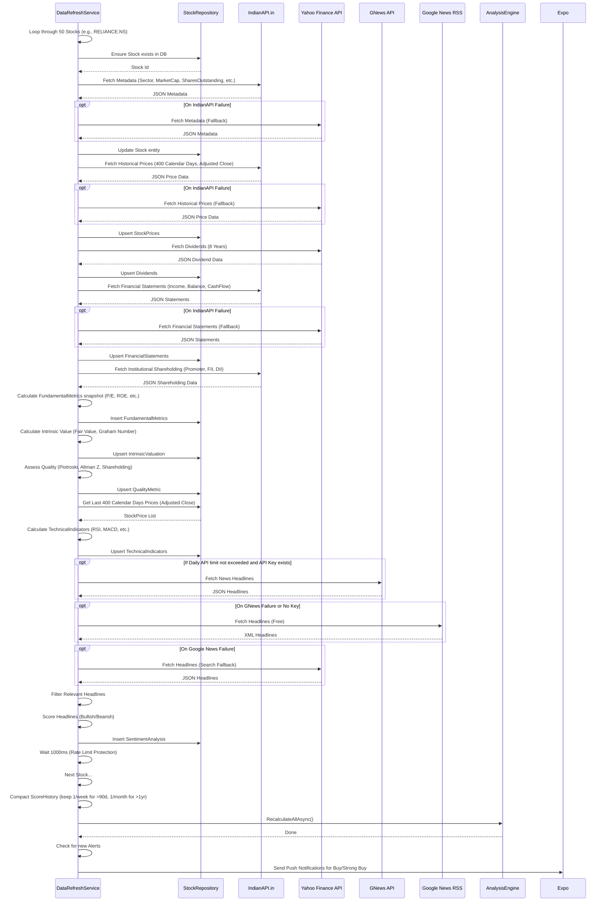

# Data Refresh Flow

The Data Refresh Flow is the heart of the Nifty50 Analyzer's automated data harvesting. Managed by the `DataRefreshService`, it systematically iterates through the Nifty50 index stocks daily at 00:00 UTC (5:30 AM IST), with smart cold-start detection, aggregating historical data and real-time metadata from various sources into the PostgreSQL database.

## Workflow Diagram

## Upsert Strategy
Because the process runs repeatedly, it is crucial not to duplicate data or violate primary keys. The `StockRepository` implements a careful "Upsert" (Update or Insert) pattern. It checks if a record for a specific Stock and Date exists; if it does, it manually updates the fields rather than attempting an EF Core `SetValues` on the primary key.

> **Note on Scheduling:** Instead of a simple `Task.Delay` by a static number of hours, the worker intelligently schedules the next iteration for the upcoming **00:00 UTC (5:30 AM IST)**. This ensures data is perfectly synchronized with the market's daily close, and correctly handles application restarts on the Render free tier (smartly skipping if a refresh already occurred since midnight).
